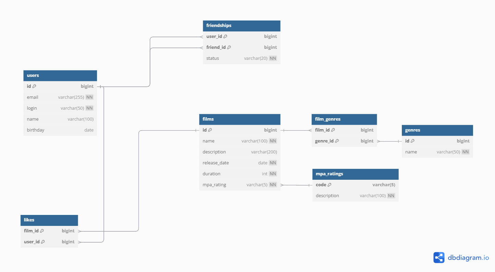

# java-filmorate
Template repository for Filmorate project.

 Описание схемы:
1) users - хранит информацию о пользователях

2) films - хранит информацию о фильмах

3) mpa_rating - справочник возрастных рейтингов

4) genres - справочник жанров

5) film_genres - связь фильмов и жанров

6) directors - режиссеры фильмов

7) film_directors - связь фильмов и режиссеров

8) likes - лайки пользователей

9) friendships - дружеские связи

10) reviews - отзывы о фильмах

11) review_likes - оценки отзывов

12) feed - лента пользовательских событий:

В рамках заданий был реализован следующий функционал:

1) Реализован вывод общих с другом фильмов с сортировкой по их популярности

2) Добавлена возможность выводить топ-N фильмов по количеству лайков

3) Добавлена функциональность для удаления фильма и пользователя по идентификатору

4) Реализована рекомендательная система для фильмов

5) Реализована возможность просмотра последних событий на платформе

6) Добавлена сущность режиссер и реализован поиск по названию фильмов и по режиссеру

7) Добавлена сущность отзывы